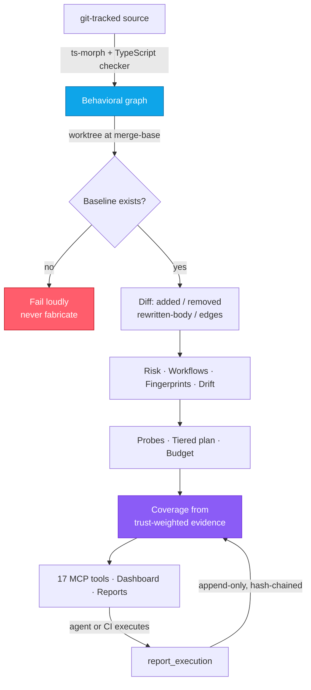

<p align="center">
  
</p>

<h1 align="center">Veris</h1>

<p align="center">
  <em>veris</em> — Latin, <em>“of truth”</em>
</p>

<p align="center">
  <strong>Your agent just changed 40 files.<br/>What actually broke, and was any of it checked?</strong>
</p>

<p align="center">
  <a href="https://github.com/vighriday/Veris/actions/workflows/veris.yml"></a>
  <a href="https://www.npmjs.com/package/veris-core"></a>
  <a href="LICENSE"></a>
  <a href="docs/MCP_TOOLS.md"></a>
  <a href="#privacy"></a>
  <a href="docs/internal/BUG_TRACKER.md"></a>
</p>

---

## We pointed Veris at Veris — it found 55 defects

Every one is published — what broke, why it mattered, the fix, and the test that
proves it: **[docs/internal/BUG_TRACKER.md](docs/internal/BUG_TRACKER.md)**

The worst three, in our own tool:

**It invented baselines.**
When git was unavailable, Veris built a "before" state from the first 70% of the
current graph and reported the comparison as a real behavioral diff. No flag. No
warning. A verification tool was fabricating the thing it verified against.

**91% of its call edges were guesses.**
It matched the trailing name of a call against every declaration sharing that name.
`console.log()` drew an edge to the project's own `Logger.log`. Measured on a real
dependency: 2,804 of 3,077 edges pointed at an ambiguous name.

**The graded agent could erase its own failures.**
Execution results were stored with `INSERT OR REPLACE`. Post `fail`, then post
`pass`, and the failure was gone.

We could have fixed these quietly. Publishing them is the point: a tool that tells
you what is unverified has no standing to hide its own unverified claims.

**This is also the demo.** That is the analysis Veris performs, run on itself.

---

## What Veris is

A **behavioral diff for AI-written code**, speaking the Model Context Protocol so
your agent can ask *while it is still working* — not after you find out in review.

It answers two questions a line diff cannot:

1. **What behavior changed?** Not which lines — which behaviors, and what reaches them.
2. **Was any of it actually checked?** Published research puts roughly **65% of
   agent-authored PRs at zero coverage of their own changed lines**.

**Veris never executes anything.** No tests, no sandboxes, no runtime. It reads,
models, and tells your agent what is at risk and what evidence exists. Running things
stays with the tools that are good at running things.

<table>
<tr><th align="left">Veris is not</th><th align="left">Because</th></tr>
<tr><td>A test runner</td><td>It executes nothing. It tells your runner what is worth running.</td></tr>
<tr><td>A linter or SAST tool</td><td>No rules about style or known-bad patterns. It models behavior change.</td></tr>
<tr><td>An "AI guardrail"</td><td>That means filtering model output. This is about the code the model writes.</td></tr>
<tr><td>A coverage tool</td><td>Coverage says which lines ran. Veris says which behaviors changed and what backs them.</td></tr>
</table>

---

## The 30-second version

```console
$ npx veris-core . --base-ref=origin/main

-> Baseline: origin/main @ 1bebd2ce2e08 -> head 3ed9031421-dirty
   Working tree has 4 uncommitted changes; this run is not reproducible from commits alone.
-> Graph: 326 nodes, 602 edges (head), 131 tracked files
-> Call resolution: 403 resolved (97.1%), 6 single-candidate, 6 ambiguous (no edge emitted)
-> Workflows: 15 detected, 3 affected in diff
-> Adversarial probes generated: 4
```

**Read lines 2 and 4 again — they are the whole philosophy.**

Six calls were too ambiguous to resolve, so Veris drew **no edge** rather than
guessing. The head is marked `-dirty` because uncommitted changes were included, so
the result is **not reproducible from commits alone**.

Most tools report only what they found. Veris also reports what it could not
determine, because a confident wrong answer is worse than an admitted gap.

---

## Install

**As an MCP server** — one config block, then restart your client:

```json
{
  "mcpServers": {
    "veris": {
      "command": "npx",
      "args": ["-y", "veris-core", "mcp"]
    }
  }
}
```

17 tools light up in Claude Code, Cursor, or any MCP-compatible agent.

**As a CLI:**

```bash
npx veris-core .                            # analyze against origin/main
npx veris-core . --base-ref=HEAD~1          # explicit baseline
npx veris-core . --budget=10 --onboarding   # 10-min plan + onboarding map
npx veris-core doctor                       # check git, base ref, deps
```

> **Needs a git repository with real history.** Veris diffs against the merge-base
> with your base ref. If it cannot establish one, it **fails and says why** rather
> than inventing a baseline. In CI: `fetch-depth: 0`.

> **On npm 12, run history needs one extra line.** npm 12 no longer runs dependency
> install scripts by default, so `better-sqlite3` never fetches its prebuilt binding.
> Veris still analyzes, diffs, scores risk and plans verification — only run history
> and cross-run drift need it. The allowlist is per-project and is *not* inherited
> from a dependency, so it has to go in **your** `package.json`:
>
> ```json
> { "allowScripts": { "better-sqlite3": true } }
> ```
>
> Then `npm rebuild better-sqlite3`. `veris-core doctor` reports which mode you are in,
> and never claims persistence is working when it is not.

---

## How it thinks



The red box is a feature. So is the loop back into coverage.

---

## Three ideas that make it different

### 1. Every edge declares how certain it is

Most graph tools give you an edge. Veris tells you **why** it believes the edge:

| `resolution` | Meaning |
|---|---|
| `resolved` | The TypeScript checker identified the declaration. Trustworthy. |
| `heuristic` | Checker couldn't, but exactly one declaration bears that name. |
| `structural` | Containment or an import relationship. |
| *(no edge)* | Several candidates and nothing distinguishes them. **Silence, not a guess.** |

Anything that must not reason on a guess — a gate, a policy rule — filters for
`resolved`. Missing edges understate coupling. They never invent it.

### 2. Evidence is append-only, and knows who said it

The agent posting results is usually the agent being judged. So:

```jsonc
{ "nodeId": "src/pay.ts::charge",
  "result": "pass",
  "trustClass": "harness-observed",   // ← default is "agent-asserted"
  "producer": "github-actions:e2e" }
```

| Trust class | Who | Weight |
|---|---|---|
| `veris-derived` | Veris computed it | full |
| `harness-observed` | An external runner saw it | full |
| `agent-asserted` | The agent says so — **the default** | **half** |

Records are hash-chained. A later pass never overwrites an earlier failure; editing
the database directly breaks the chain and `verifyEvidenceChain()` reports exactly
where. **An agent cannot raise its own assurance by asserting harder.**

### 3. It catches the rewrite that keeps its name

```diff
- function chargeCard(amount) { return gateway.charge(amount); }
+ function chargeCard(amount) { return gateway.charge(amount * 100); }
```

Same name. Same callees. Same graph shape. Every name-and-topology comparison sees
nothing. Veris hashes the **normalized body**, so this surfaces as a `modifiedNode` —
while renaming a directory, which used to look like 100% drift, now correctly looks
like nothing at all.

---

## What your agent asks

```text
veris: analyze_pr_behavior with baseRef=origin/main
veris: list_workflows, then analyze_workflow for the highest-risk one
veris: generate_adversarial_probes, then allocate_budget minutes=15
veris: detect_drift
veris: what_if_revert nodeIds=[...]
```

Probes are concrete, not nudges:

> **Payments / idempotency** — Submit a charge twice with the same idempotency key
> inside a 500 ms window.
> **Invariant:** exactly one ledger entry; the second call returns the first result.
>
> ---
>
> **Webhooks / replay** — Replay a 24-hour-old signed payload with its original
> signature.
> **Invariant:** rejected by timestamp window even though the signature is valid.

---

## Everything else it does

| | |
|---|---|
| **Semantic workflows** | 25 domains — Authentication, Payments, Checkout, Webhooks, Queue, Caching… So the unit is "checkout reliability", not `GraphModels.ts`. |
| **Risk model** | Coupling magnitude, inbound-coupling dominance, runtime criticality — three inputs measuring different things. Every weight in `data/risk-config.json`, plain-English reasons attached. |
| **Drift detection** | Fingerprints across runs. Catches silent rewrites, surface changes, oscillating refactors, and deletions. |
| **Budget allocation** | Given N minutes, the highest-leverage subset to actually run. |
| **Counterfactual** | `what_if_revert` — what recovers if this comes out? |
| **Onboarding export** | Workflow-first markdown for a new engineer, or a new agent, on an unfamiliar codebase. |
| **Dashboard** | Standalone HTML. Click a workflow, everything filters. Click-to-copy directives. |

---

## Honest limits

Stated plainly, so nobody discovers them the hard way.

- **A workflow is a label, not a path.** Classification is a weighted keyword vote over
  directory names, imports and symbol names. It does not traverse the call graph.
  Rate-limiting code that imports Redis lands in Caching. *Making workflows real paths
  is the top roadmap item.*
- **Coverage is not assurance.** It measures how much planned verification has evidence
  behind it. It is **not calibrated against real incidents** and does not estimate the
  probability your code is correct.
- **Risk is a heuristic.** Good for ranking what to look at first. Not a defect
  predictor. No ground truth behind it.
- **Probes are a curated library** — real failure modes, written by hand, selected by
  domain. Not generated from your code.
- **TypeScript and JavaScript only.** Python and Go are on the roadmap.
- **Some calls can't be resolved.** Dynamic dispatch and untyped JS defeat the checker.
  Those produce no edge, and the count is in the output.

> **Upgrading from 2.x?** 3.0 has real breaking changes — see [UPGRADING.md](UPGRADING.md).

---

## Privacy & security

- **Local-first.** All analysis runs on your machine. **No telemetry, ever.** Nothing
  about your code leaves the machine.
- **Zero-retention mode** — `VERIS_STATE_DISABLED=1`.
- **No network sockets in the analyzer.** stdio and the filesystem only.

Veris is usually pointed at repositories you did *not* write, so repository content is
untrusted input. **Plugins execute code from the analyzed repo, so they are off by
default** — `--allow-plugins` opts in, and each plugin's path and SHA-256 is printed
before it runs. There is no sandbox, and [SECURITY.md](SECURITY.md) says so plainly
instead of implying otherwise.

---

## Docs

| | |
|---|---|
| [MCP tools](docs/MCP_TOOLS.md) | All 17 tools with recommended flows |
| [Architecture](ARCHITECTURE.md) | Design invariants and the defect each replaced |
| [Audit tracker](docs/internal/BUG_TRACKER.md) | All 55 findings, with evidence |
| [Upgrading](UPGRADING.md) | 2.x → 3.0 |
| [Security](SECURITY.md) | Threat model and reporting |
| [Roadmap](ROADMAP.md) | What is next — and what will never be built |
| [Plugins](docs/PLUGINS.md) | Extending classification and risk |

---

## Contributing

The five things that move the needle most:

1. **Entry-point detection** for a framework you know — routes, handlers, queue
   consumers. This is what turns a workflow from a label into a path.
2. **Labelled repositories** for a classification benchmark. The accuracy claim needs
   ground truth, not more rules.
3. **Probe provenance.** The shipped probes are good and uncited; one backed by a
   public postmortem is worth ten that aren't.
4. **Language adapters** — Python, Go.
5. **Calibration data** — what Veris flagged that broke, and what it missed. *The
   second is more valuable.*

See [CONTRIBUTING.md](CONTRIBUTING.md). Open source, sponsor-supported. No paid tier,
no gated features, no open-core bait.

<p align="center"><sub>MIT — see <a href="LICENSE">LICENSE</a></sub></p>
